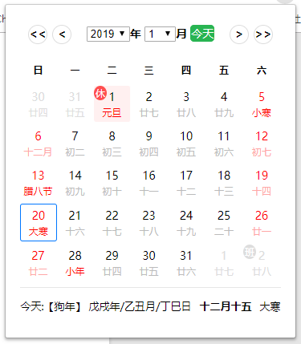

# calendar.crx
中国节假日日历插件, 自动更新2018年后的节假日，应chrome上网友要求增加了周数显示。

Firefox安装地址：https://addons.mozilla.org/zh-CN/firefox/addon/%E8%8A%82%E5%81%87%E6%97%A5%E6%97%A5%E5%8E%86/ 
Chrome安装地址：https://chrome.google.com/webstore/detail/%E8%8A%82%E5%81%87%E6%97%A5%E6%97%A5%E5%8E%86/nbnocjjjcabknnadklnobhnlnlbgcfnj

* 效果图（[查看示例效果](https://x2009again.github.io/HolidayCalendar/)）

  

参考：https://github.com/gyxing/calendar.crx
感谢提莫的神秘商店提供的免费节假日api：http://timor.tech/api/holiday/

